# parse函数

## 模版AST

对于如下模版

```js
<div>
    <h1 v-if="ok">Vue Template</h1>
</div>
```

这段模板会被编译为如下所示的 AST：

```js
const ast = {
    // 逻辑根节点
    type: 'Root',
    children: [
        // div 标签节点
        {
            type: 'Element',
            tag: 'div',
            children: [
                // h1 标签节点
                {
                    type: 'Element',
                    tag: 'h1',
                    props: [
                        // v-if 指令节点
                        {
                            type: 'Directive', // 类型为 Directive 代表指令
                            name: 'if', // 指令名称为 if，不带有前缀 v-
                            exp: {
                                // 表达式节点
                                type: 'Expression',
                                content: 'ok'
                            }
                        }
                    ]
                }
            ]
        }
    ]
}

```

- 不同类型的节点是通过节点的 type 属性进行区分的。例如标签节点的 type 值为 'Element'。

- 标签节点的子节点存储在其 children 数组中。

- 标签节点的属性节点和指令节点会存储在 props 数组中。

- 不同类型的节点会使用不同的对象属性进行描述。例如指令节点拥有 name 属性，用来表达指令的名称，而表达式节点拥有content 属性，用来描述表达式的内容。


## 词法分析，建立 Token列表

### 伪代码

```js
// 定义状态机的状态
const State = {
    initial: 1, // 初始状态
    tagOpen: 2, // 标签开始状态
    tagName: 3, // 标签名称状态
    text: 4, // 文本状态
    tagEnd: 5, // 结束标签状态
    tagEndName: 6 // 结束标签名称状态
}
// 一个辅助函数，用于判断是否是字母
function isAlpha(char) {
    return (char >= 'a' && char <= 'z') || (char >= 'A' && char <= 'Z')
}

// 接收模板字符串作为参数，并将模板切割为 Token 返回
function tokenize(str) {
    // 状态机的当前状态：初始状态
    let currentState = State.initial
    // 用于缓存字符
    const chars = []
    // 生成的 Token 会存储到 tokens 数组中，并作为函数的返回值返回
    const tokens = []
    // 使用 while 循环开启自动机，只要模板字符串没有被消费尽，自动机就会一直运行
    while (str) {
        // 查看第一个字符，注意，这里只是查看，没有消费该字符
        const char = str[0]
        // switch 语句匹配当前状态
        switch (currentState) {
            // 状态机当前处于初始状态
            case State.initial:
                // 遇到字符 <
                if (char === '<') {
                    // 1. 状态机切换到标签开始状态
                    currentState = State.tagOpen
                    // 2. 消费字符 <
                    str = str.slice(1)
                } else if (isAlpha(char)) {
                    // 1. 遇到字母，切换到文本状态
                    currentState = State.text
                    // 2. 将当前字母缓存到 chars 数组
                    chars.push(char)
                    // 3. 消费当前字符
                    str = str.slice(1)
                }
                break
            // 状态机当前处于标签开始状态
            case State.tagOpen:
                if (isAlpha(char)) {
                    // 1. 遇到字母，切换到标签名称状态
                    currentState = State.tagName
                    // 2. 将当前字符缓存到 chars 数组
                    chars.push(char)
                    // 3. 消费当前字符
                    str = str.slice(1)
                } else if (char === '/') {
                    // 1. 遇到字符 /，切换到结束标签状态
                    currentState = State.tagEnd
                    // 2. 消费字符 /
                    str = str.slice(1)
                }
                break
            // 状态机当前处于标签名称状态
            case State.tagName:
                if (isAlpha(char)) {
                    // 1. 遇到字母，由于当前处于标签名称状态，所以不需要切换状态，
                    // 但需要将当前字符缓存到 chars 数组
                    chars.push(char)
                    // 2. 消费当前字符
                    str = str.slice(1)
                } else if (char === '>') {
                    // 1.遇到字符 >，切换到初始状态
                    currentState = State.initial
                    // 2. 同时创建一个标签 Token，并添加到 tokens 数组中
                    // 注意，此时 chars 数组中缓存的字符就是标签名称
                    tokens.push({
                        type: 'tag',
                        name: chars.join('')
                    })
                    // 3. chars 数组的内容已经被消费，清空它
                    chars.length = 0
                    // 4. 同时消费当前字符 >
                    str = str.slice(1)
                }
                break
            // 状态机当前处于文本状态
            case State.text:
                if (isAlpha(char)) {
                    // 1. 遇到字母，保持状态不变，但应该将当前字符缓存到 chars 数组
                    chars.push(char)
                    // 2. 消费当前字符
                    str = str.slice(1)
                } else if (char === '<') {
                    // 1. 遇到字符 <，切换到标签开始状态
                    currentState = State.tagOpen
                    // 2. 从 文本状态 --> 标签开始状态，此时应该创建文本 Token，并添加到 tokens 数组
                    // 注意，此时 chars 数组中的字符就是文本内容
                    tokens.push({
                        type: 'text',
                        content: chars.join('')
                    })
                    // 3. chars 数组的内容已经被消费，清空它
                    chars.length = 0
                    // 4. 消费当前字符
                    str = str.slice(1)
                }
                break
            // 状态机当前处于标签结束状态
            case State.tagEnd:
                if (isAlpha(char)) {
                    // 1. 遇到字母，切换到结束标签名称状态
                    currentState = State.tagEndName
                    // 2. 将当前字符缓存到 chars 数组
                    chars.push(char)
                    // 3. 消费当前字符
                    str = str.slice(1)
                }
                break
            // 状态机当前处于结束标签名称状态
            case State.tagEndName:
                if (isAlpha(char)) {
                    // 1. 遇到字母，不需要切换状态，但需要将当前字符缓存到 chars数组
                    chars.push(char)
                    // 2. 消费当前字符
                    str = str.slice(1)
                } else if (char === '>') {
                    // 1. 遇到字符 >，切换到初始状态
                    currentState = State.initial
                    // 2. 从 结束标签名称状态 --> 初始状态，应该保存结束标签名称Token
                    // 注意，此时 chars 数组中缓存的内容就是标签名称
                    tokens.push({
                        type: 'tagEnd',
                        name: chars.join('')
                    })
                    // 3. chars 数组的内容已经被消费，清空它
                    chars.length = 0
                    // 4. 消费当前字符
                    str = str.slice(1)
                }
                break
        }
    }

    // 最后，返回 tokens
    return tokens
}

```

### 状态机

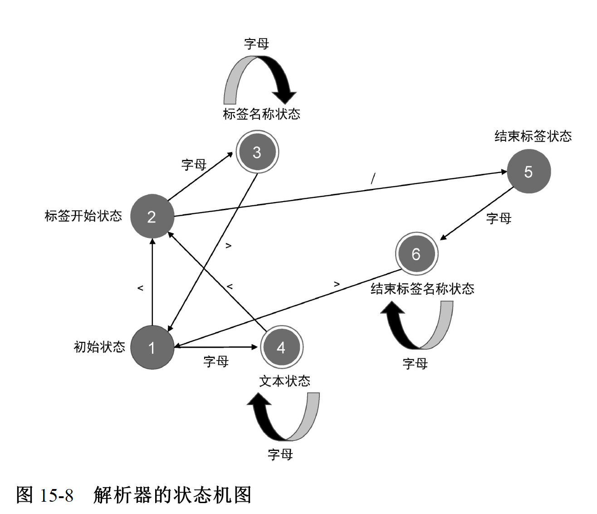

## 结果

这里的type和vnode的type不是一个意思

```js
const tokens = tokenize(`<div><p>Vue</p><p>Template</p></div>`)
const tokens = [
    { type: 'tag', name: 'div' }, // div 开始标签节点
    { type: 'tag', name: 'p' }, // p 开始标签节点
    { type: 'text', content: 'Vue' }, // 文本节点
    { type: 'tagEnd', name: 'p' }, // p 结束标签节点
    { type: 'tag', name: 'p' }, // p 开始标签节点
    { type: 'text', content: 'Template' }, // 文本节点
    { type: 'tagEnd', name: 'p' }, // p 结束标签节点
    { type: 'tagEnd', name: 'div' } // div 结束标签节点
]
```

## 建立 AST

### 伪代码

```js
// parse 函数接收模板作为参数
function parse(str) {
    // 首先对模板进行标记化，得到 tokens
    const tokens = tokenize(str)
    // 创建 Root 根节点
    const root = {
        type: 'Root',
        children: []
    }
    // 创建 elementStack 栈，起初只有 Root 根节点
    const elementStack = [root]

    // 开启一个 while 循环扫描 tokens，直到所有 Token 都被扫描完毕为止
    while (tokens.length) {
        // 获取当前栈顶节点作为父节点 parent
        const parent = elementStack[elementStack.length - 1]
        // 当前扫描的 Token
        const t = tokens[0]
        switch (t.type) {
            case 'tag':
                // 如果当前 Token 是开始标签，则创建 Element 类型的 AST 节点
                const elementNode = {
                    type: 'Element',
                    tag: t.name,
                    children: []
                }
                // 将其添加到父级节点的 children 中
                parent.children.push(elementNode)
                // 将当前节点压入栈
                elementStack.push(elementNode)
                break
            case 'text':
                // 如果当前 Token 是文本，则创建 Text 类型的 AST 节点
                const textNode = {
                    type: 'Text',
                    content: t.content
                }
                // 将其添加到父节点的 children 中
                parent.children.push(textNode)
                break
            case 'tagEnd':
                // 遇到结束标签，将栈顶节点弹出
                elementStack.pop()
                break
        }
        // 消费已经扫描过的 token
        tokens.shift()
    }

    // 最后返回 AST
    return root
}

```

### 结果

```js
const ast = parse(`<div><p>Vue</p><p>Template</p></div>`)

ast={
    type: 'Root',
    children: [
        {
            type: 'Element',
            tag: 'div',
            children: [
                {
                    type: 'Element',
                    tag: 'p',
                    children: [{ type: 'Text', content: 'Vue' }]
                },
                {
                    type: 'Element',
                    tag: 'p',
                    children: [{ type: 'Text', content: 'Template' }]
                }
            ]
        }
    ]
}
```


### 过程

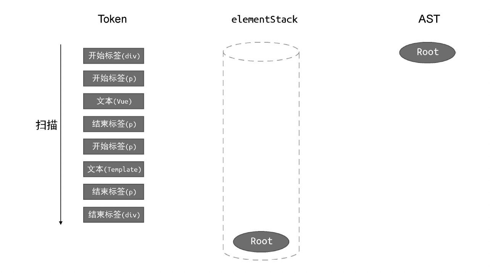

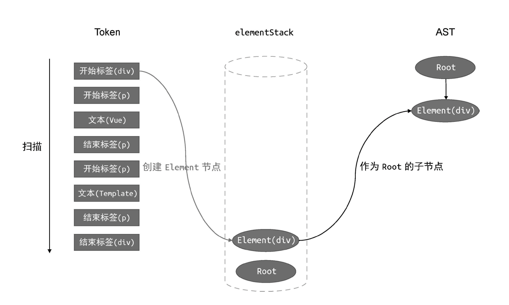

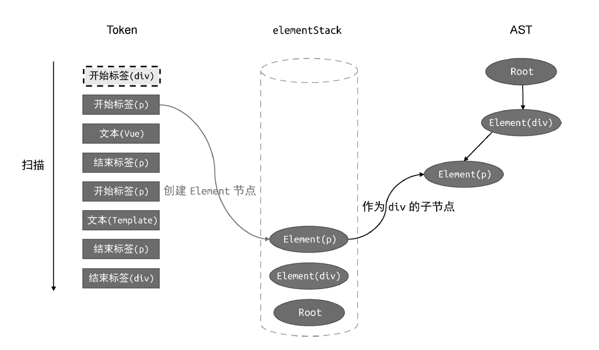

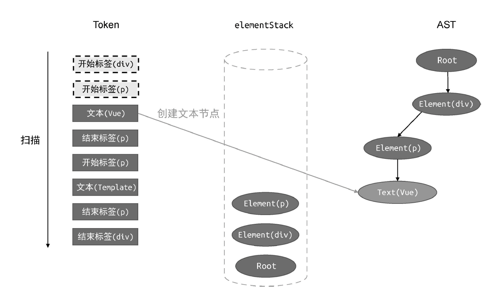

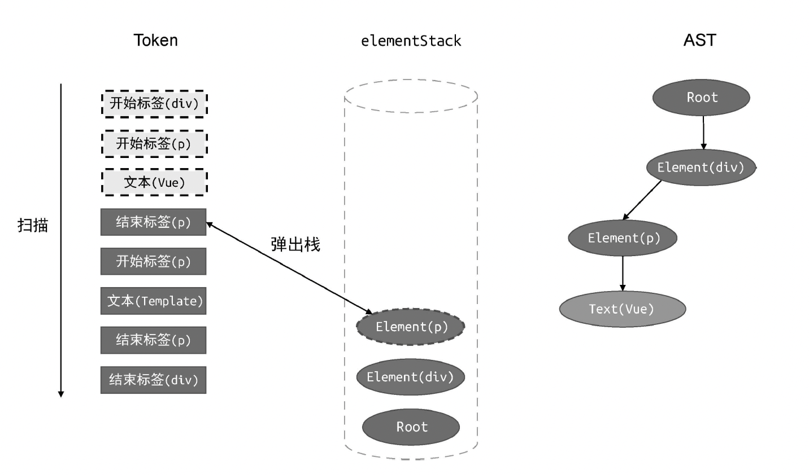

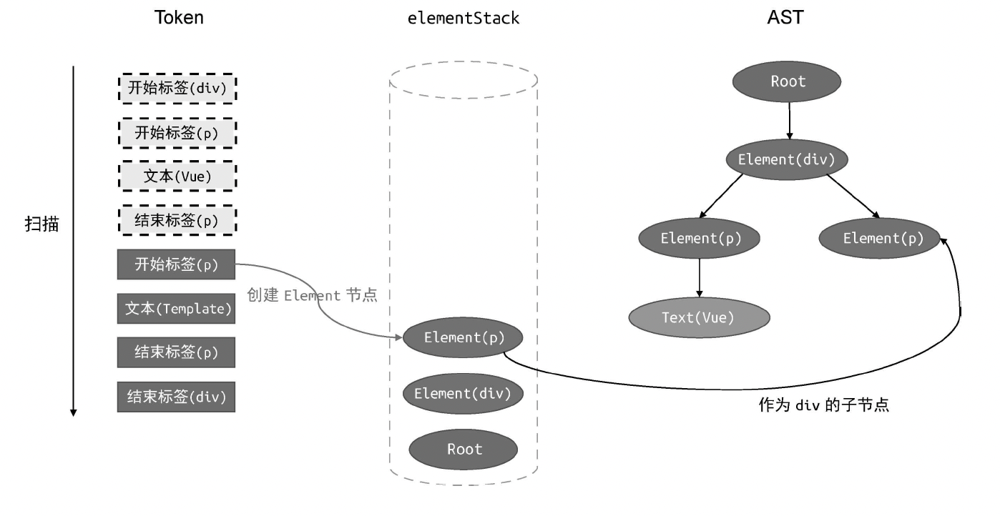

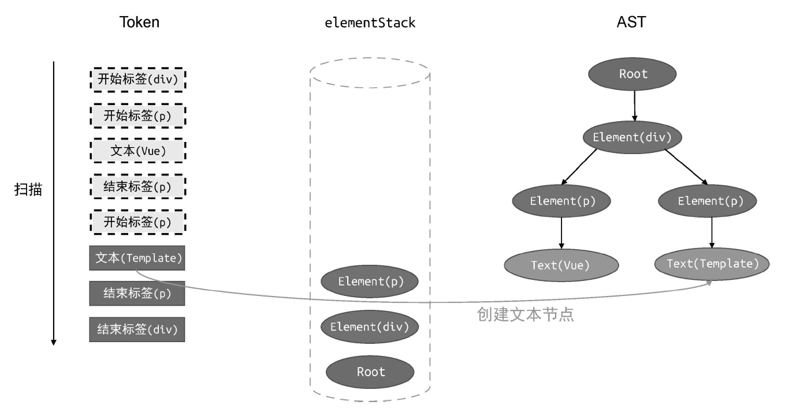

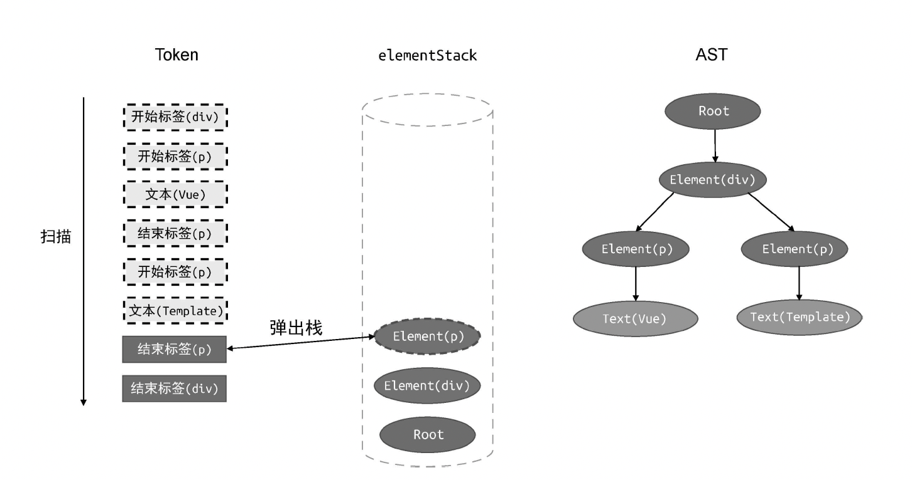

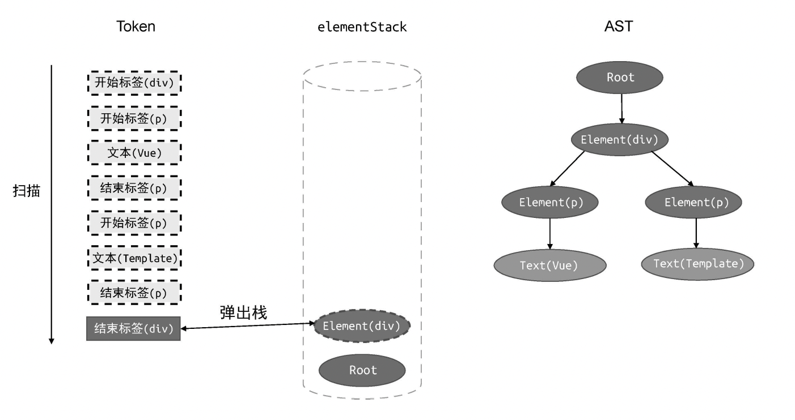

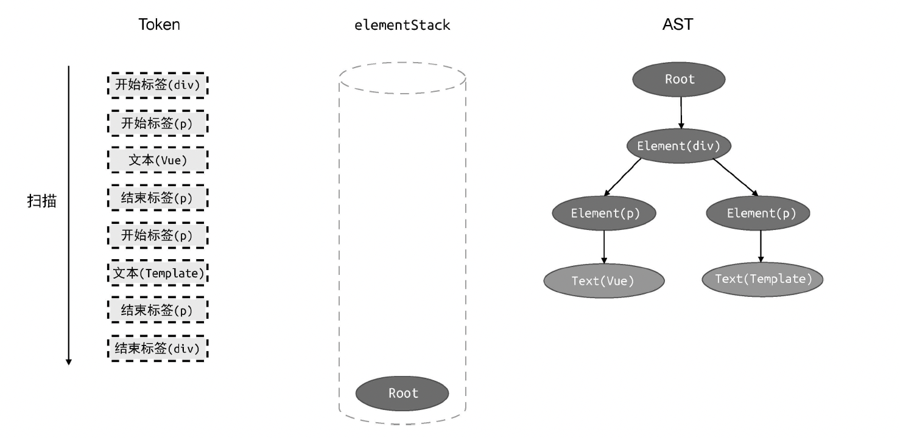