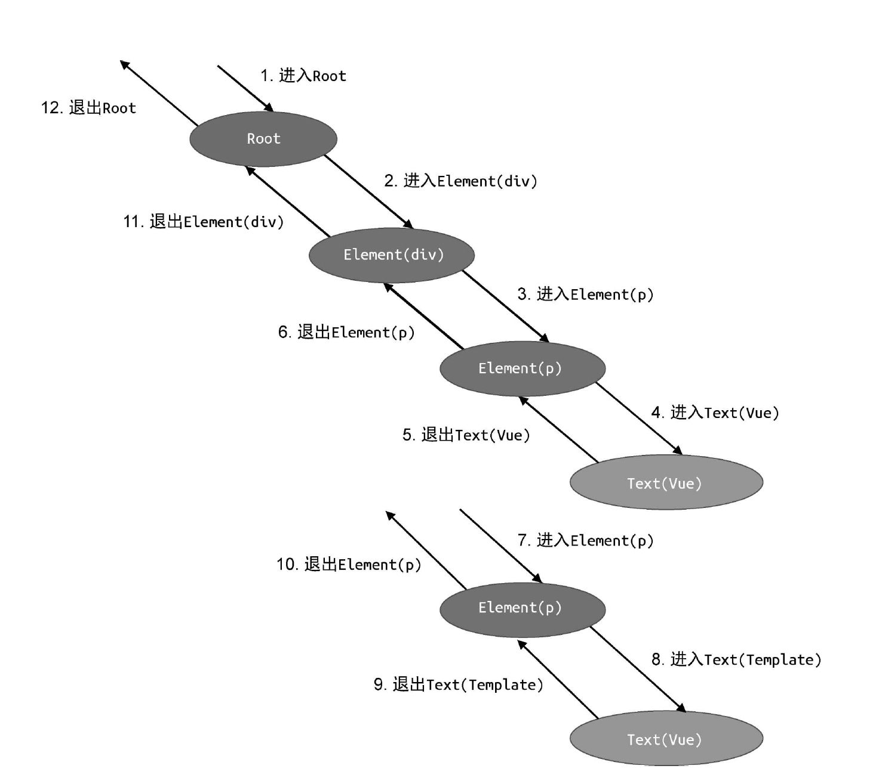

# transform

## AST 的转换与插件化架构

```js
function transform(ast) {
    const context = {
        currentNode: null,
        parent: null,
        replaceNode(node) {
            context.currentNode = node
            context.parent.children[context.childIndex] = node
        },
        // 用于删除当前节点。
        removeNode() {
            if (context.parent) {
                // 调用数组的 splice 方法，根据当前节点的索引删除当前节点
                context.parent.children.splice(context.childIndex, 1)
                // 将 context.currentNode 置空
                context.currentNode = null
            }
        },
        nodeTransforms: [transformElement, transformText]
    }

    traverseNode(ast, context)
    console.log(dump(ast))
}

function traverseNode(ast, context) {
    context.currentNode = ast
    // 1. 退出阶段的回调函数数组
    const exitFns = []
    // 进入阶段的回调函数数组
    const transforms = context.nodeTransforms
    for (let i = 0; i < transforms.length; i++) {
        // 2. 转换函数可以返回另外一个函数，该函数即作为退出阶段的回调函数
        const onExit = transforms[i](context.currentNode, context)
        if (onExit) {
            // 将退出阶段的回调函数添加到 exitFns 数组中
            exitFns.push(onExit)
        }
        if (!context.currentNode) return
    }

    const children = context.currentNode.children
    if (children) {
        for (let i = 0; i < children.length; i++) {
            context.parent = context.currentNode
            context.childIndex = i
            traverseNode(children[i], context)
        }
    }

    // 在节点处理的最后阶段执行缓存到 exitFns 中的回调函数
    // 注意，这里我们要反序执行
    let i = exitFns.length
    while (i--) {
        exitFns[i]()
    }
}

// 比如我想将所有的p标签替换成h1
function transformElement(node) {
    if (node.type === 'Element' && node.tag === 'p') {
        node.tag = 'h1'
    }
}

// 将所有text重复一遍
function transformText(node) {
    if (node.type === 'Text') {
        node.content = node.content.repeat(2)
    }
}
```

### traverse

深度优先遍历

### context

这里的 context 可以看作 AST 转换函数过程中的上下文数据。所有 AST 转换函数都可以通过 context 来共享数据。上下文对象中通常会维护程序的当前状态，例如当前转换的节点是哪一个？当前转换的节点的父节点是谁？甚至当前节点是父节点的第几个子节点？等等。这些信息对于编写复杂的转换函数非常有用。

### 回调函数



我们把进入回调函数存储到 nodeTransforms 数组中，退出阶段的回调函数数组存储到 exitFns 数组中

在不同阶段遍历该数组，并逐个调用注册在其中的回调函数。这么做可以使traverse函数不那么臃肿

## 将模板 AST 转为 JavaScript AST

### JavaScript AST

```js
<div><p>Vue</p><p>Template</p></div>

function render(){
  return h('div',[
    h('p','Vue'),
    h('p','Template')
  ])
}

// 函数声明 JavaScript AST
const FunctionDeclNode = {
    type: 'FunctionDecl', // 代表该节点是函数声明
    // 函数的名称是一个标识符，标识符本身也是一个节点
    id: {
        type: 'Identifier',
        name: 'render' // name 用来存储标识符的名称，在这里它就是渲染函数的称 render
    },
    params: [], // 参数，目前渲染函数还不需要参数，所以这里是一个空数组
    // 渲染函数的函数体只有一个语句，即 return 语句
    body: [
        {
            type: 'ReturnStatement',
            // 最外层的 h 函数调用
            return: {
                type: 'CallExpression',
                callee: { type: 'Identifier', name: 'h' },
                arguments: [
                    // 第一个参数是字符串字面量 'div'
                    {
                        type: 'StringLiteral',
                        value: 'div'
                    },
                    // 第二个参数是一个数组
                    {
                        type: 'ArrayExpression',
                        elements: [
                            // 数组的第一个元素是 h 函数的调用
                            {
                                type: 'CallExpression',
                                callee: { type: 'Identifier', name: 'h' },
                                arguments: [
                                    // 该 h 函数调用的第一个参数是字符串字面量
                                    { type: 'StringLiteral', value: 'p' },
                                    // 第二个参数也是一个字符串字面量
                                    { type: 'StringLiteral', value: 'Vue' }
                                ]
                            },
                            // 数组的第二个元素也是 h 函数的调用
                            {
                                type: 'CallExpression',
                                callee: { type: 'Identifier', name: 'h' },
                                arguments: [
                                    // 该 h 函数调用的第一个参数是字符串字面量
                                    { type: 'StringLiteral', value: 'p' },
                                    // 第二个参数也是一个字符串字面量
                                    { type: 'StringLiteral', value: 'Template' }
                                ]
                            }
                        ]
                    }
                ]
            }
        }
    ]
}

```


### 添加回调函数实现转化功能

辅助函数

```js
// 用来创建 StringLiteral 节点
function createStringLiteral(value) {
    return {
        type: 'StringLiteral',
        value
    }
}
// 用来创建 Identifier 节点
function createIdentifier(name) {
    return {
        type: 'Identifier',
        name
    }
}
// 用来创建 ArrayExpression 节点
function createArrayExpression(elements) {
    return {
        type: 'ArrayExpression',
        elements
    }
}
// 用来创建 CallExpression 节点
function createCallExpression(callee, arguments) {
    return {
        type: 'CallExpression',
        callee: createIdentifier(callee),
        arguments
    }
}

```


```js
function transformText(node) {
    // 如果不是文本节点，则什么都不做
    if (node.type !== 'Text') {
        return
    }
    // 文本节点对应的 JavaScript AST 节点其实就是一个字符串字面量，
    // 因此只需要使用 node.content 创建一个 StringLiteral 类型的节点即可
    // 最后将文本节点对应的 JavaScript AST 节点添加到 node.jsNode 属性下
    node.jsNode = createStringLiteral(node.content)
}

// 转换标签节点
function transformElement(node) {
    // 将转换代码编写在退出阶段的回调函数中，
    // 这样可以保证该标签节点的子节点全部被处理完毕
    return () => {
        // 如果被转换的节点不是元素节点，则什么都不做
        if (node.type !== 'Element') {
            return
        }

        // 1. 创建 h 函数调用语句,
        // h 函数调用的第一个参数是标签名称，因此我们以 node.tag 来创建一个字符串字面量节点
        // 作为第一个参数
        const callExp = createCallExpression('h', [
            createStringLiteral(node.tag)
        ])
        // 2. 处理 h 函数调用的参数
        node.children.length === 1
            ? // 如果当前标签节点只有一个子节点，则直接使用子节点的 jsNode 作为参数
              callExp.arguments.push(node.children[0].jsNode)
            : // 如果当前标签节点有多个子节点，则创建一个 ArrayExpression 节点作为参数
              callExp.arguments.push(
                  // 数组的每个元素都是子节点的 jsNode
                  createArrayExpression(node.children.map(c => c.jsNode))
              )
        // 3. 将当前标签节点对应的 JavaScript AST 添加到 jsNode 属性下
        node.jsNode = callExp
    }
}

// 转换 Root 根节点
function transformRoot(node) {
    // 将逻辑编写在退出阶段的回调函数中，保证子节点全部被处理完毕
    return () => {
        // 如果不是根节点，则什么都不做
        if (node.type !== 'Root') {
            return
        }
        // node 是根节点，根节点的第一个子节点就是模板的根节点，
        // 当然，这里我们暂时不考虑模板存在多个根节点的情况
        const vnodeJSAST = node.children[0].jsNode
        // 创建 render 函数的声明语句节点，将 vnodeJSAST 作为 render 函数体的返回语句
        node.jsNode = {
            type: 'FunctionDecl',
            id: { type: 'Identifier', name: 'render' },
            params: [],
            body: [
                {
                    type: 'ReturnStatement',
                    return: vnodeJSAST
                }
            ]
        }
    }
}
```

- 在转换标签节点时，我们需要将转换逻辑编写在退出阶段的回调函数内，这样才能保证其子节点全部被处理完毕；

- 无论是文本节点还是标签节点，它们转换后的 JavaScript AST 节点都存储在节点的 node.jsNode 属性下。