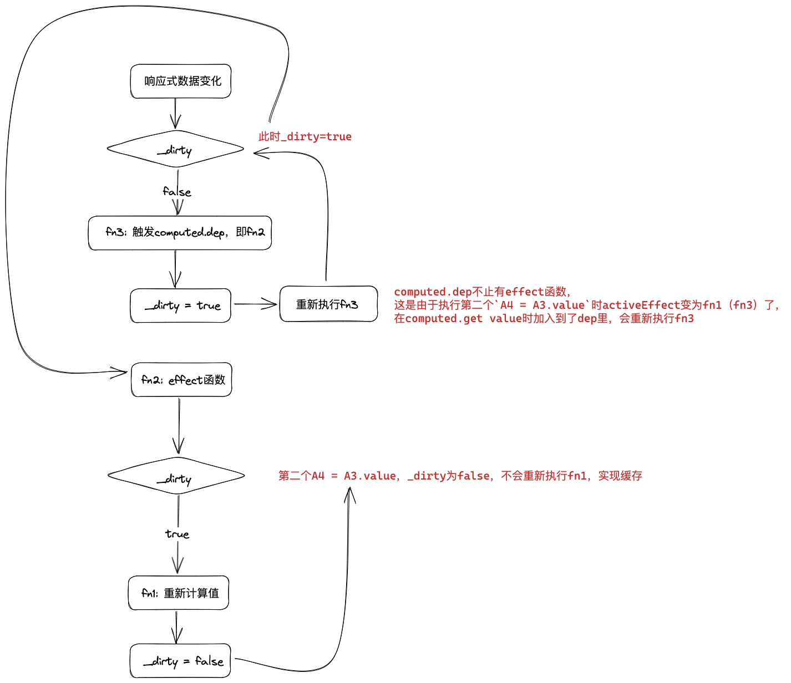
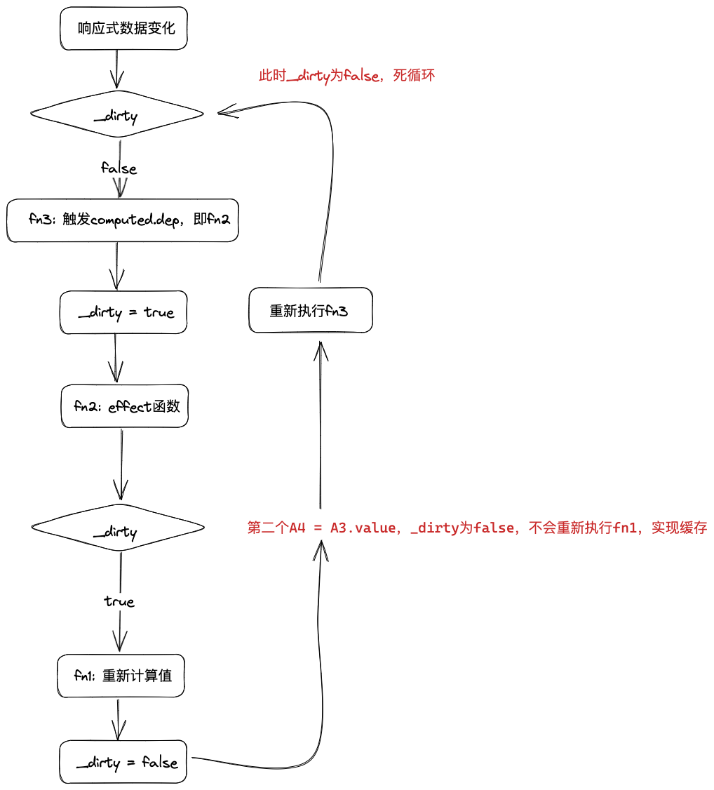

# computed函数

## 伪代码

```js
function trigger(target, key) {
    if ((fn = targetMap.get(target)?.get(key))) {
        if (fn.scheduler) {
            fn.scheduler()
        } else fn()
    }
}

class computed {
    constructor(fn) {
        this.dep = new Set()
     
        this.effect = fn
      
        fn.scheduler = () => {
          // fn3
            if (!this._dirty) {
                this._dirty = true
                 ;[...this.dep].forEach(effect => {
                    if (effect.scheduler) effect.scheduler()
                })
                ;[...this.dep].forEach(effect => {
                    if (!effect.scheduler) effect()
                })
            }
        }
        this._dirty = true
    }

    get value() {
        if (activeEffect) {
            this.dep.add(activeEffect)
        }
        if (this._dirty) {
            this._dirty = false
            activeEffect = this.effect
            this._value = this.effect()
        }
        return this._value
    }
}

```

## computed的缓存与死循环

对于这样一个例子

```js
let obj = reactive({
    A0: 1,
    A1: 2
})

let A3 = new computed(() => {
  // fn1
    console.log('执行一次计算属性函数')
    return obj.A0 + obj.A1
})

let A4

effect(() => {
  // fn2
    A4 = A3.value
    A4 = A3.value
})


console.log(A4) // 3

obj.A0 = 2

console.log(A4) // 4
```

### 流程图

- fn1: 在computed.get value中执行，用于重新计算新值
- fn2: 触发响应性后需要执行的effect函数
- fn3: 一个函数，用于触发computed.dep中收集的依赖，即触发fn2

**响应式数据发生变化 -> fn3 -> fn2 -> fn1**





### 缓存

关注流程图的` _dirty` 变量

### 死循环

存在这样一种情况



:::warning

所以在依赖触发时，需要谨记，先触发 `computed` 的 `effect`（重新执行fn3），再触发非 `computed` 的 `effect`（fn2）

:::


```js
//  避免死循环的写法
if (!this._dirty) {
  this._dirty = true
  [...this.dep].forEach(effect => {
    if (effect.scheduler) effect.scheduler()
  })
  [...this.dep].forEach(effect => {
    if (!effect.scheduler) effect()
  })
}
```

