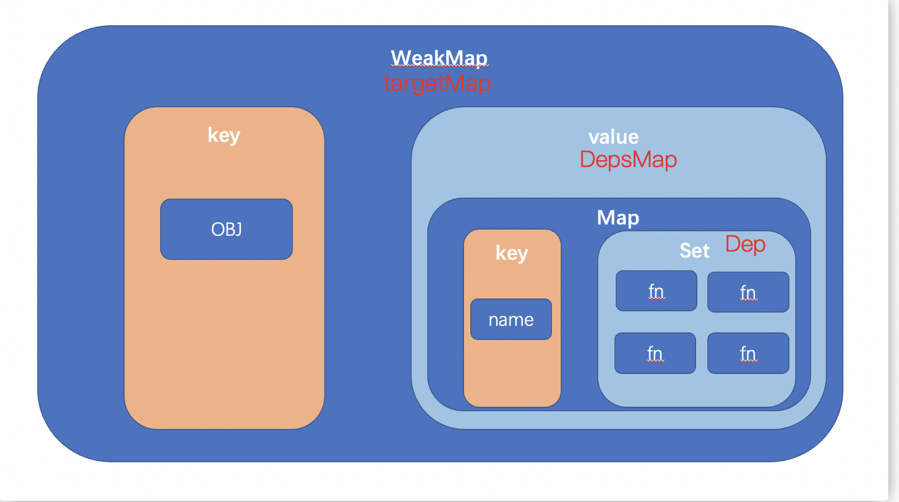

# reactive函数

## 伪代码

```js
// 单例的，当前的 effect
let activeEffect

// 依赖收集的地方，是一个weakmap套一个map
// 记录了哪个对象的哪个key对应着哪个函数
const targetMap = new WeakMap()

function reactive(obj) {
    return new Proxy(obj, {
        get(target, key) {
            track(target, key)
            return target[key]
        },
        set(target, key, value) {
            target[key] = value
            trigger(target, key)
        }
    })
}

function track(target, key) {
    if (activeEffect) {
        // 依赖收集
        if (targetMap.get(target)) {
            targetMap.get(target).set(key, activeEffect)
        } else targetMap.set(target, new Map().set(key, activeEffect))
    }
}

function trigger(target, key) {
    // 依赖触发
    if ((fn = targetMap.get(target)?.get(key))) {
        fn()
    }
}

function effect(fn) {
    activeEffect = fn
    fn()
    activeEffect = null
}

let obj = reactive({
    A0: 1,
    A1: 2
})

let A3
// 执行第一遍，触发obj的get，进行依赖收集
effect(() => {
    A3 = obj.A0 + obj.A1
})
console.log(A3)

// 触发obj的set，进行依赖触发
obj.A0 = 2
console.log(A3)

```

## 详细实现

与伪代码不同

- **实际代码中effect不是单纯的函数，而是一个被封装的对象**

1. 首先我们在 `packages/reactivity/src/reactive.ts` 中，创建了一个 `reactive` 函数，该函数可以帮助我们生成一个 `proxy` 实例对象
2. 通过该 `proxy` 实例的 `handler` 可以监听到对应的 `getter` 和 `setter`
3. 然后我们在 `packages/reactivity/src/effect.ts` 中，创建了一个 `effect` 函数，通过该函数可以创建一个 `ReactiveEffect` 的实例，该实例的构造函数可以接收传入的回调函数 `fn`，并且提供了一个 `run` 方法
4. 触发 `run` 可以为 `activeEffect` 进行赋值，并且执行 `fn` 函数
5. 我们需要在 `fn` 函数中触发 `proxy` 的 `getter`，以此来激活 `handler` 的 `get` 函数
6. 在 `handler` 的 `get` 函数中，我们通过 `WeakMap` 收集了 **指定对象，指定属性** 的 `fn`，这样的一步操作，我们把它叫做 **依赖收集**
7. 最后我们可以在 **任意时刻**，修改 `proxy` 的数据，这样会触发 `handler` 的 `setter`
8. 在 `handler` 的 `setter` 中，我们会根据 **指定对象 `target`** 的 **指定属性 `key`** 来获取到保存的 **依赖**，然后我们只需要触发依赖，即可达到修改数据的效果


- **副作用订阅将被存储在一个全局的 `WeakMap<target, Map<key, Set<effect>>>` 数据结构中。如果在第一次追踪时没有找到对相应属性订阅的副作用集合，它将会在这里新建。**

  :::tip
  
  **Map的Value是Set的原因**：可能会有多个effect依赖了同一个target的同一个key，所以用set，依赖触发的时候循环set，触发所有依赖
  
  :::




## Reactive函数的局限性

1. 对于 `reactive` 函数而言，它会把传入的 **object** 作为 `proxy` 的 `target` 参数，而对于 `proxy` 而言，他只能代理 **对象**，而不能代理简单数据类型，所以说：**我们不可以使用 `reactive` 函数，构建简单数据类型的响应性**。

2. 一个数据是否具备响应性的关键在于：**是否可以监听它的 `getter` 和 `setter` **。而根据我们的代码可知，只有 `proxy` 类型的 **代理对象** 才可以被监听 `getter` 和 `setter` ，而一旦解构，对应的属性将不再是 `proxy` 类型的对象，所以：**解构之后的属性，将不具备响应性。**