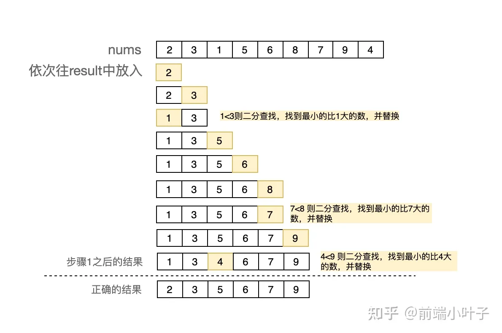
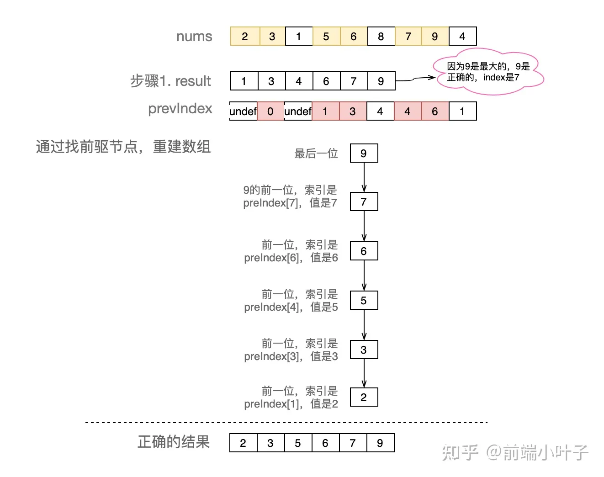
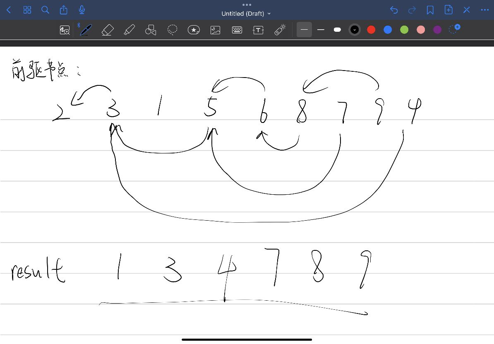
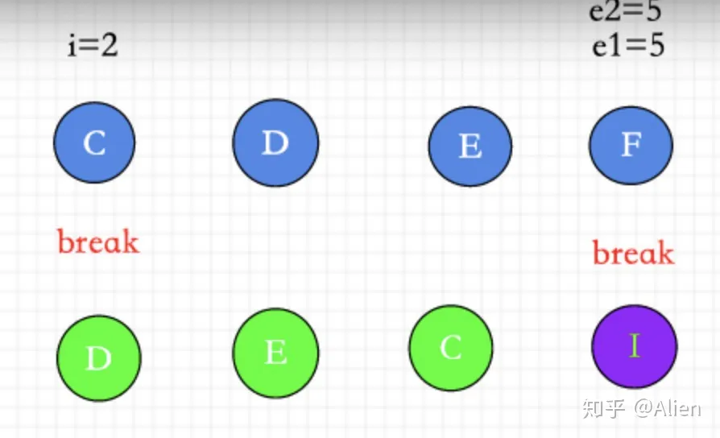
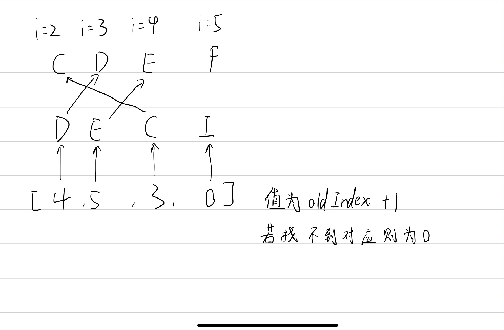
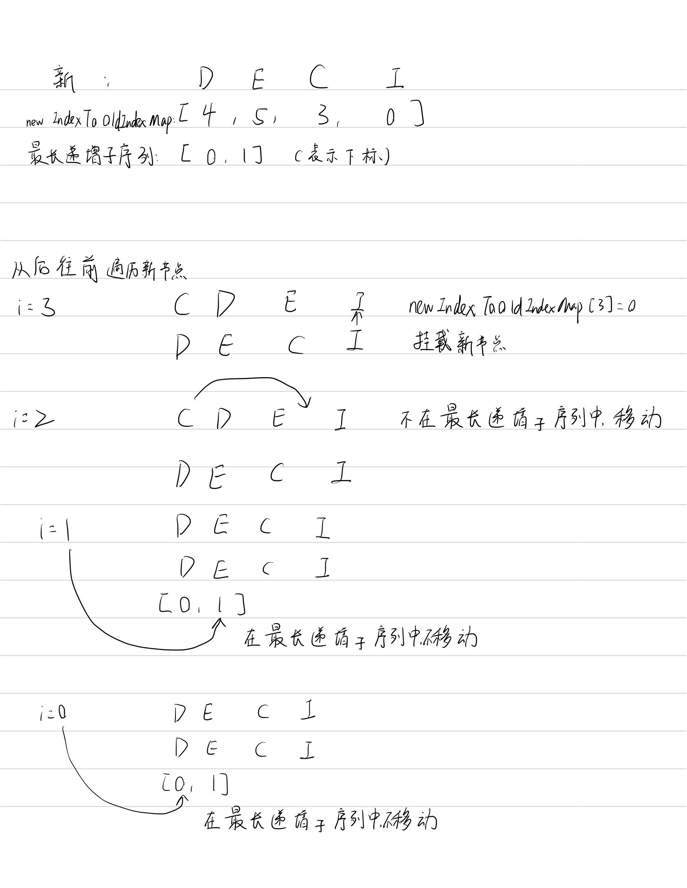

# diff 算法

## 核心逻辑

`patchChildren` 的方法，该方法的主要作用是为了 **更新子节点**，即：**为子节点打补丁**。

子节点的类型多种多样，如果两个 `ELEMENT` 的子节点都是 `TEXT_CHILDREN` 的话，那么直接通过 `setText` 附新值即可。

但是如果 **新旧 `ELEMENT` 的子节点都为 `ARRAY_CHILDREN`** 的话，那么想要完成一个 **高效** 的更新就会比较复杂了。这个时候，我们就需要，**比较两组子节点**，以达到一个高效的更新功能。这种 **比较的算法** 就是 `diff` 算法。

`vue` 中对 `diff` 算法的描述在 `packages/runtime-core/src/renderer.ts` 的 `patchKeyedChildren（1759行）` 方法中，观察该方法，可以发现该方法内部被分成了 `5` 块（ 5 种场景）：

1. `sync from start`：自前向后的对比
2. `sync from end`：自后向前的对比
3. `common sequence + mount`：新节点多于旧节点，需要挂载
4. `common sequence + unmount`：旧节点多于新节点，需要卸载
5. `unknown sequence`：乱序


## 常规场景

### 一、自前向后的diff对比

**只有 vnode 的 key 和 type 都相同，才是 isSameVNodeType**

```js
 // 1. 自前向后的 diff 对比。经过该循环之后，从前开始的相同 vnode 将被处理
        while (i <= oldChildrenEnd && i <= newChildrenEnd) {
            const oldVNode = oldChildren[i]
            const newVNode = normalizeVNode(newChildren[i])
            // 如果 oldVNode 和 newVNode 被认为是同一个 vnode，则直接 patch 即可
            if (isSameVNodeType(oldVNode, newVNode)) {
                patch(oldVNode, newVNode, container, null)
            }
            // 如果不被认为是同一个 vnode，则直接跳出循环
            else {
                break
            }
            // 下标自增
            i++
```

### 二、自后向前的diff对比

```js
 // 2. 自后向前的 diff 对比。经过该循环之后，从后开始的相同 vnode 将被处理
        while (i <= oldChildrenEnd && i <= newChildrenEnd) {
            const oldVNode = oldChildren[oldChildrenEnd]
            const newVNode = normalizeVNode(newChildren[newChildrenEnd])
            if (isSameVNodeType(oldVNode, newVNode)) {
                patch(oldVNode, newVNode, container, null)
            } else {
                break
            }
            oldChildrenEnd--
            newChildrenEnd--
        }
```

经过第一步和第二步，此时新旧孩子的前面相同vnode和后面相同vnode已经处理好了

### 三、新节点多于旧节点时的 diff 比对

```js
 // 3. 新节点多余旧节点时的 diff 比对。
        if (i > oldChildrenEnd) {
            if (i <= newChildrenEnd) {
                const nextPos = newChildrenEnd + 1
                const anchor =
                    nextPos < newChildrenLength
                        ? newChildren[nextPos].el
                        : parentAnchor
                while (i <= newChildrenEnd) {
                    patch(
                        null,
                        normalizeVNode(newChildren[i]),
                        container,
                        anchor
                    )
                    i++
                }
            }
        }
```

### 四、旧节点多于新节点时的 diff 比对

```js
 // 4. 旧节点多与新节点时的 diff 比对。
        else if (i > newChildrenEnd) {
            while (i <= oldChildrenEnd) {
                unmount(oldChildren[i])
                i++
            }
        }
```

## 乱序场景

### 最长递增子序列的作用

所谓的 `diff`，其实说白了就是对 **一组节点** 进行 **添加、删除、打补丁** 的对应操作。那么除了以上三种操作之外，其实还有最后一种操作方式，那就是 **移动**。

**最长递增子序列的确定，可以帮助我们减少移动的次数**


旧节点：1,2,3,4,5,6 

新节点：1,3,2,4,6,5

我们可以根据 **新节点** 生成 **递增子序列（非最长）（注意：并不是惟一的）**，其结果为：

1. `1、3、6`
2. `1、2、4、6`
3. …

我们来分析一下移动的策略，整个移动根据递增子序列的不同，将拥有两种移动策略：

1. ```
   1、3、6
   ```

    

   递增序列下：

   1. 因为 `1、3、6` 的递增已确认，所以它们三个是不需要移动的，那么我们所需要移动的节点无非就是 **三** 个 `2、4、5` 。
   2. 所以我们需要经过 **三次** 移动

2. ```
   1、2、4、6
   ```

    

   递增序列下：

   1. 因为 `1、2、4、6` 的递增已确认，所以它们四个是不需要移动的，那么我们所需要移动的节点无非就是 **两个** `3、5` 。
   2. 所以我们需要经过 **两次** 移动

所以由以上分析，我们可知：**最长递增子序列的确定，可以帮助我们减少移动的次数**

所以，当我们需要进行节点移动时，移动需要事先构建出最长递增子序列，以保证我们的移动方案


### 求解最长递增子序列

```js
/**
 * 获取最长递增子序列下标
 * 维基百科：https://en.wikipedia.org/wiki/Longest_increasing_subsequence
 */
function getSequence(arr) {
    // 获取一个数组浅拷贝。注意 p 的元素改变并不会影响 arr
    // p 是一个最终的回溯数组，它会在最终的 result 回溯中被使用
    // 它会在每次 result 发生变化时，记录 result 更新前最后一个索引的值
    const p = arr.slice()
    // 定义返回值（最长递增子序列下标），因为下标从 0 开始，所以它的初始值为 0
    const result = [0]
    let i, j, u, v, c
    // 当前数组的长度
    const len = arr.length
    // 对数组中所有的元素进行 for 循环处理，i = 下标
    for (i = 0; i < len; i++) {
        // 根据下标获取当前对应元素
        const arrI = arr[i]
        //
        if (arrI !== 0) {
            // 获取 result 中的最后一个元素，即：当前 result 中保存的最大值的下标
            j = result[result.length - 1]
            // arr[j] = 当前 result 中所保存的最大值
            // arrI = 当前值
            // 如果 arr[j] < arrI 。那么就证明，当前存在更大的序列，那么该下标就需要被放入到 result 的最后位置
            if (arr[j] < arrI) {
                p[i] = j
                // 把当前的下标 i 放入到 result 的最后位置
                result.push(i)
                continue
            }

            // 二分查找，找到 arr[result[x]] > arrI 的最小 x
            u = 0
            v = result.length - 1
            while (u < v) {
                c = (u + v) >> 1
                if (arr[result[c]] < arrI) {
                    u = c + 1
                } else {
                    v = c
                }
            }
            // 最终，经过 while 的二分运算可以计算出：目标下标位 u
            // 利用 u 从 result 中获取下标，然后拿到 arr 中对应的值：arr[result[u]]
            // 如果：arr[result[u]] > arrI 的，则证明当前  result 中存在的下标 《不是》 递增序列，则需要进行替换
            if (arrI < arr[result[u]]) {
                if (u > 0) {
                    p[i] = result[u - 1]
                }
                // 进行替换，替换为递增序列
                result[u] = i
            }
        }
    }
    // 重新定义 u。此时：u = result 的长度
    u = result.length
    // 重新定义 v。此时 v = result 的最后一个元素
    v = result[u - 1]
    // 自后向前处理 result，利用 p 中所保存的索引值，进行最后的一次回溯
    while (u-- > 0) {
        result[u] = v
        v = p[v]
    }
    return result
}

```

第一步：先创建一个空数组result保存索引。遍历nums，将当前项`current`和result的最后一项对应的值`last`进行比较。如果当前项大于最后一项，直接往result中新增一项；否则，针对result数组进行二分查找，找到并替换比当前项大的那项。**下图示意图中为了方便理解result存放的是nums中的值，实际代码存放的是数组索引。**



第二步：步骤1得到的结果不正确，要利用p数组修正

使用的`前驱节点`的概念，需要再创建一个数组preIndexArr（p）。在步骤1往result中新增或者替换新值的时候，同时preIndexArr新增一项，该项为当前项对应的前一项的索引。这样我们有了两个数组：

注意：nums和prevIndex一一对应



前驱节点的作用：




### 实现

对于



1. 创建一个 <key（新节点的 key）:index（新节点的位置）> 的 Map 对象 keyToNewIndexMap。通过该对象可知：新的 child（根据 key 判断指定 child） 更新后的位置（根据对应的 index 判断）在哪里


遍历所有新节点把索引和对应的key,存入map keyToNewIndexMap中


***keyToNewIndexMap*** 存放 key -> index 的map


***D : 2***

***E : 3***

***C : 4***

***I : 5***


2. 循环 oldChildren ，并尝试进行 patch（打补丁）或 unmount（删除）旧节点

***第一步： 通过老节点的key找到对应新节点的index:开始遍历老的节点，判断有没有key***

- 如果存在key通过新节点的keyToNewIndexMap找到与新节点index
- 如果不存在key那么会遍历剩下来的新节点试图找到对应index。

***第二步：如果存在index证明有对应的老节点，那么直接复用老节点进行patch，没有找到与老节点对应的新节点，删除当前老节点。***

- 在这一步进行patch 或者 unmount 操作

***第三步：newIndexToOldIndexMap记录对应新老节点关系。***


newIndexToOldIndexMap 此时为 [4,5,3,0]




3. 针对移动和挂载的处理

虽然已经patch过所有的老节点。可以对于已经发生移动的节点，要怎么真正移动dom元素。（图中节点CDE）

对于新增的节点，（图中节点I）并没有处理，应该怎么处理。

生成 newIndexToOldIndexMap 的最长递增子序列，为 [0,1] ,注意里面放的是 newIndexToOldIndexMap 的下标



